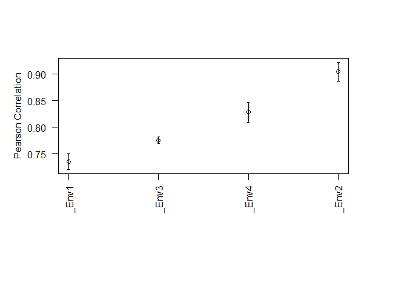
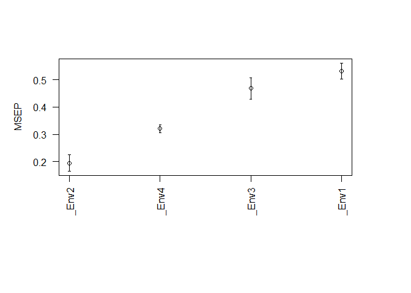
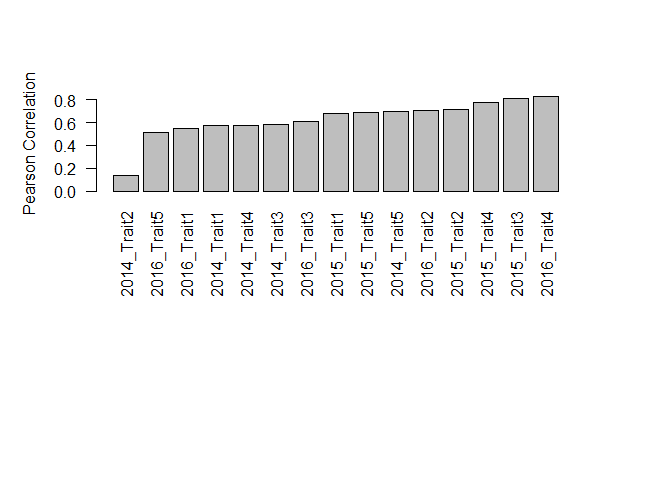
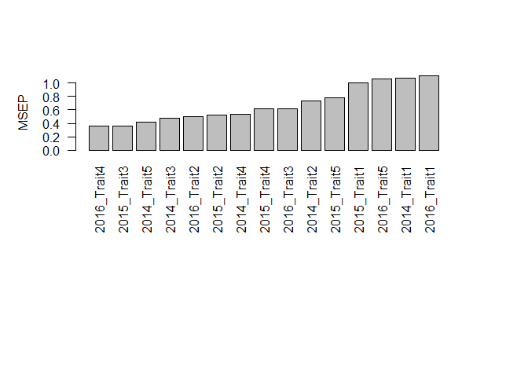

IBCF.MTME
================
Last README update: 2018-02-14

Item Based Collaborative Filterign For Multi-trait and Multi-environment Data in R.

Instructions for proper implementation
--------------------------------------

### Installation

To complete installation of dev version of IBCF.MTME from GitHub, you must have previously installed the devtools package.

``` r
install.packages('devtools')
devtools::install_github('frahik/IBCF.MTME')
```

### Quick use

### Load the package

``` r
library(IBCF.MTME)
```

### Cross-validation IBCF

#### Load example data

``` r
library(BGLR)
data(wheat)
```

#### Get DataSet in Tidy data form

``` r
pheno <- data.frame(ID = gl(n = 599, k = 1, length = 599*4),
                    Response = as.vector(wheat.Y),
                    Env = paste0('Env', gl(n = 4, k = 599)))

head(pheno)
```

    ##   ID   Response  Env
    ## 1  1  1.6716295 Env1
    ## 2  2 -0.2527028 Env1
    ## 3  3  0.3418151 Env1
    ## 4  4  0.7854395 Env1
    ## 5  5  0.9983176 Env1
    ## 6  6  2.3360969 Env1

#### Generate 10 partitions to do cross-validation

``` r
CrossV <- CV.RandomPart(pheno, NPartitions = 10, PTesting = 0.25, Set_seed = 123)
```

#### Fitting the model

``` r
pm <- IBCF(CrossV)
```

#### Show some results

``` r
summary(pm)
```

    ##   Trait_Env Pearson SE_Cor   MSEP SE_MSEP
    ## 1     _Env1  0.7349 0.0075 0.5319  0.0155
    ## 2     _Env2  0.9044 0.0033 0.1947  0.0074
    ## 3     _Env3  0.7757 0.0096 0.4686  0.0199
    ## 4     _Env4  0.8280 0.0090 0.3212  0.0151

``` r
par(mai = c(2, 1, 1, 1))
plot(pm, select = 'Pearson')
```



``` r
plot(pm, select = 'MSEP')
```



### IBCF.Years Function

#### Loading your data

``` r
load('DataExample.RData')
head(Data.Example)
```

    ##   Years Gids  Trait Response
    ## 1  2014    1 Trait1 15.14401
    ## 2  2014    2 Trait1 15.67879
    ## 3  2014    3 Trait1 14.85489
    ## 4  2014    4 Trait1 13.57002
    ## 5  2014    5 Trait1 15.01838
    ## 6  2014    6 Trait1 13.19616

#### Transforming the data from Tidy data to matrix form

``` r
Data.Example <- getMatrixForm(Data.Example, onlyTrait = TRUE)
head(Data.Example)
```

    ##   Years Gids   Trait1  Trait10  Trait11  Trait12   Trait2   Trait3
    ## 1  2014    1 15.14401 18.51428 17.08970 19.16776 16.21435 17.53858
    ## 2  2014    2 15.67879 18.21569 17.89645 19.94429 15.80614 17.89946
    ## 3  2014    3 14.85489 17.72576 15.78198 17.53058 14.06164 16.11997
    ## 4  2014    4 13.57002 18.57009 15.73343 17.49995 14.58312 15.22495
    ## 5  2014    5 15.01838 18.57348 16.97414 19.03081 14.98192 15.65125
    ## 6  2014    6 13.19616 16.83588 15.12312 17.39867 15.81264 14.80517
    ##     Trait4   Trait5   Trait6   Trait7   Trait8   Trait9
    ## 1 15.51840 17.59132 17.14852 17.04474 17.48970 18.36118
    ## 2 15.13337 18.36446 17.32734 17.46764 18.08501 18.67266
    ## 3 15.04329 17.28942 16.50978 16.26685 17.02774 17.05612
    ## 4 14.93028 16.33687 15.11493 15.06632 17.56798 16.48810
    ## 5 16.70963 16.81113 17.24170 15.53379 16.07600 16.54047
    ## 6 14.82150 16.49238 15.37325 14.07796 15.98419 15.84705

#### Adjust the model

``` r
pm <- IBCF.Years(Data.Example, colYears = 1, Years.testing = c('2014', '2015', '2016'), Traits.testing = c('Trait1', 'Trait2', 'Trait3', 'Trait4', "Trait5"))
```

#### Show some results

``` r
summary(pm)
```

    ##              Year_Trait Pearson   MSEP
    ## 2014_Trait1 2014_Trait1  0.5713 1.0727
    ## 2014_Trait2 2014_Trait2  0.1332 0.7386
    ## 2014_Trait3 2014_Trait3  0.5846 0.4731
    ## 2014_Trait4 2014_Trait4  0.5770 0.5368
    ## 2014_Trait5 2014_Trait5  0.6969 0.4196
    ## 2015_Trait1 2015_Trait1  0.6776 1.0086
    ## 2015_Trait2 2015_Trait2  0.7127 0.5186
    ## 2015_Trait3 2015_Trait3  0.8109 0.3643
    ## 2015_Trait4 2015_Trait4  0.7731 0.6150
    ## 2015_Trait5 2015_Trait5  0.6907 0.7784
    ## 2016_Trait1 2016_Trait1  0.5483 1.1167
    ## 2016_Trait2 2016_Trait2  0.7043 0.4959
    ## 2016_Trait3 2016_Trait3  0.6086 0.6153
    ## 2016_Trait4 2016_Trait4  0.8342 0.3531
    ## 2016_Trait5 2016_Trait5  0.5124 1.0643

``` r
par(mai = c(3, 1, 1, 1))
barplot(pm, las = 2)
```



``` r
barplot(pm, select = 'MSEP', las = 2)
```



#### Load data from the package to do some test

``` r
library(IBCF.MTME)
data('Wheat_IBCF')

head(Wheat_IBCF)
```

    ##       GID Trait    Env   Response
    ## 1 6569128    DH Bed2IR -17.565895
    ## 2 6688880    DH Bed2IR  -4.565895
    ## 3 6688916    DH Bed2IR  -3.565895
    ## 4 6688933    DH Bed2IR  -4.565895
    ## 5 6688934    DH Bed2IR  -7.565895
    ## 6 6688949    DH Bed2IR  -7.565895

``` r
data('Year_IBCF')

head(Year_IBCF)
```

    ##   Years Gids Trait Response
    ## 1  2014    1    T1 5.144009
    ## 2  2014    2    T1 5.678792
    ## 3  2014    3    T1 4.854895
    ## 4  2014    4    T1 3.570019
    ## 5  2014    5    T1 5.018380
    ## 6  2014    6    T1 3.196160

Citation
--------

How to cite the package... Coming soon.

Issues
------

Feel free to report new issues in this link [Issues](https://github.com/frahik/IBCF.MTME/issues/new)

Authors
-------

-   Francisco Javier Luna-Vázquez (Author, Maintainer)
-   Osval Antonio Montesinos-López (Author)
-   Abelardo Montesinos-López (Author)
-   José Crossa (Author)
