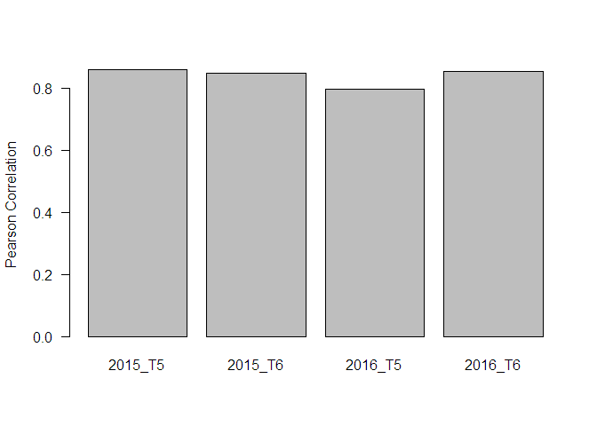
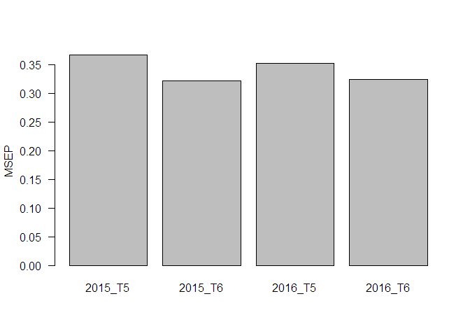

IBCF.MTME
================
Francisco Javier Luna-Vázquez
2018-02-10

Item Based Collaborative Filterign For Multi-trait and Multi-environment Data in R.

Instructions for proper implementation
--------------------------------------

### Installation

To complete installation of dev version of IBCF.MTME from GitHub, you must have previously installed the devtools package.

``` r
install.packages('devtools')
devtools::install_github('frahik/IBCF.MTME')
```

### Quick use

#### Load data

``` r
rm(list = ls())
library(IBCF.MTME)
data('Wheat_IBCF')

head(Wheat_IBCF)
```

    ##       GID Trait    Env   Response
    ## 1 6569128    DH Bed2IR -17.565895
    ## 2 6688880    DH Bed2IR  -4.565895
    ## 3 6688916    DH Bed2IR  -3.565895
    ## 4 6688933    DH Bed2IR  -4.565895
    ## 5 6688934    DH Bed2IR  -7.565895
    ## 6 6688949    DH Bed2IR  -7.565895

``` r
data('Year_IBCF')

head(Year_IBCF)
```

    ##   Years Gids Trait Response
    ## 1  2014    1    T1 5.144009
    ## 2  2014    2    T1 5.678792
    ## 3  2014    3    T1 4.854895
    ## 4  2014    4    T1 3.570019
    ## 5  2014    5    T1 5.018380
    ## 6  2014    6    T1 3.196160

### Cross-validation IBCF

``` r
CrossV <- CV.RandomPart(Wheat_IBCF, NPartitions = 10, PTesting = 0.25, Set_seed = 123)

pm <- IBCF(CrossV)
summary(pm)
```

    ##      Trait_Env Pearson SE_Cor   MSEP SE_MSEP
    ## 1    DH_Bed2IR  0.9597 0.0036 3.7767  0.3262
    ## 2    DH_Bed5IR  0.9611 0.0060 2.8238  0.4393
    ## 3      DH_Drip  0.9757 0.0018 0.6122  0.0432
    ## 4    GY_Bed2IR  0.7572 0.0143 0.1030  0.0051
    ## 5    GY_Bed5IR  0.8929 0.0050 0.0193  0.0009
    ## 6      GY_Drip  0.8735 0.0077 0.0460  0.0030
    ## 7  NDVI_Bed2IR  0.9251 0.0046 0.0000  0.0000
    ## 8  NDVI_Bed5IR  0.9418 0.0021 0.0000  0.0000
    ## 9    NDVI_Drip  0.9093 0.0059 0.0001  0.0000
    ## 10   PH_Bed2IR  0.8202 0.0102 4.9820  0.2742
    ## 11   PH_Bed5IR  0.8793 0.0062 8.4841  0.3827
    ## 12     PH_Drip  0.8696 0.0063 8.2196  0.2796

``` r
par(mai = c(2, 1, 1, 1))
plot(pm, select = 'Pearson')
```


``` r
plot(pm, select = 'MSEP')
```

    ## Warning in arrows(x, results[, select] - results$SE, x, results[, select]
    ## + : zero-length arrow is of indeterminate angle and so skipped

    ## Warning in arrows(x, results[, select] - results$SE, x, results[, select]
    ## + : zero-length arrow is of indeterminate angle and so skipped

    ## Warning in arrows(x, results[, select] - results$SE, x, results[, select]
    ## + : zero-length arrow is of indeterminate angle and so skipped

    ## Warning in arrows(x, results[, select] - results$SE, x, results[, select]
    ## + : zero-length arrow is of indeterminate angle and so skipped


### IBCF.Years Function

``` r
data('Year_IBCF')
DataSet <- getMatrixForm(Year_IBCF, withYears = T)

pm4 <- IBCF.Years(DataSet , Years.testing = c('2015', '2016'), Traits.testing = c('T5', 'T6'))
summary(pm4)
```

    ##         Year_Trait Pearson   MSEP
    ## 2015_T5    2015_T5  0.8582 0.3665
    ## 2015_T6    2015_T6  0.8475 0.3218
    ## 2016_T5    2016_T5  0.7953 0.3525
    ## 2016_T6    2016_T6  0.8539 0.3245

``` r
barplot(pm4, select = 'Pearson')
```



``` r
barplot(pm4, select = 'MSEP')
```



### Transform TidyData to Matrix and rollback

``` r
data('Wheat_IBCF')

M <- getMatrixForm(Wheat_IBCF)
dim(M)
```

    ## [1] 250  13

``` r
Tidy <- getTidyForm(M)
dim(Tidy)
```

    ## [1] 3000    4

Citation
--------

How to cite the package...

Authors
-------

Francisco Javier Luna-Vázquez (Author, Maintainer)

Osval Antonio Montesinos-López (Author)
