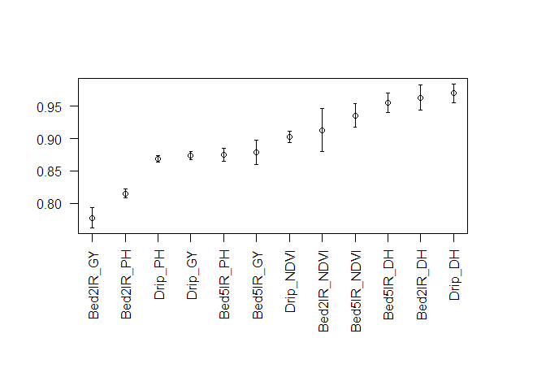
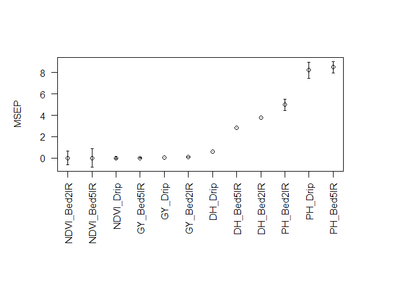

IBCF.MTME
================
Francisco Javier Luna-Vázquez
2018-02-06

Item Based Collaborative Filterign For Multi-trait and Multi-environment Data in R.

Instructions for proper implementation
--------------------------------------

### Installation

To complete installation of dev version of IBCF.MTME from GitHub, you have to install a few packages first.

``` r
install.packages('devtools')
devtools::install_github('frahik/IBCF.MTME')
```

### Quick use

#### Load data

``` r
rm(list = ls())
library(IBCF.MTME)
data('Wheat_IBCF')

DataSet <- data.frame(Data.Trigo_IBCF[,-1]) # Load from wheat_BGFRA data

dim(DataSet)
```

    ## [1] 250  13

``` r
head(DataSet)
```

    ##       Gid  Bed5IR_DH  Bed2IR_DH   Drip_DH  Bed5IR_NDVI  Bed2IR_NDVI
    ## 1 6569128  1.6923078 -17.565895  0.945047 -0.002449404 -0.016692414
    ## 2 6688880 -0.3076922  -4.565895  0.945047 -0.011380990 -0.016657172
    ## 3 6688916 -1.3076922  -3.565895 -2.054953 -0.000877320  0.002233731
    ## 4 6688933 -3.3076922  -4.565895 -1.054953 -0.011128989 -0.009772406
    ## 5 6688934 -3.3076922  -7.565895 -0.054953 -0.010064999 -0.002767986
    ## 6 6688949 -6.3076922  -7.565895 -2.054953  0.002153392 -0.015566957
    ##      Drip_NDVI   Bed5IR_GY   Bed2IR_GY     Drip_GY  Bed5IR_PH  Bed2IR_PH
    ## 1  0.006528357 -0.38496851 -0.35188724 -0.44365852  -1.282471  -6.968964
    ## 2 -0.022684209 -0.29930171 -0.61107566 -0.19868885  -8.725086 -11.030829
    ## 3 -0.030087900 -0.30202380 -0.03534797 -0.09566196  -6.680635 -10.494572
    ## 4  0.003965353  0.08545996 -0.11721194 -0.03161493  -5.546853  -4.033027
    ## 5  0.008624755 -0.24010219  0.05415546 -0.35510868 -11.590284 -12.103778
    ## 6 -0.021943740  0.19542652 -0.48406932 -0.04798615  -1.954483  -5.316197
    ##      Drip_PH
    ## 1  3.6682234
    ## 2 -3.6481125
    ## 3 -6.1052408
    ## 4  0.7411906
    ## 5 -6.4430134
    ## 6  3.0296975

### Cross-validation model

``` r
##############Example of how to use the IBCF fucntion#######
CV <- CV.RandomPart(NLine = nrow(DataSet), NEnv = 3, NTraits = 4, NPartitions =  10, PTesting = 0.2, Set_seed = 5)

IBCF_Wheat <- IBCF(DataSet = DataSet, CrossValidation = CV)

IBCF_Wheat$Ave_predictions
```

    ##      Env_Trait   Pearson      Cor_SE         MSEP      MSEP_SE
    ## 1    Bed5IR_DH 0.9553870 0.008206702 3.237381e+00 5.536694e-01
    ## 2    Bed2IR_DH 0.9636410 0.003593301 3.387745e+00 3.148134e-01
    ## 3      Drip_DH 0.9702301 0.002487230 7.471933e-01 5.351929e-02
    ## 4  Bed5IR_NDVI 0.9358702 0.003185817 2.711550e-05 1.271907e-06
    ## 5  Bed2IR_NDVI 0.9131947 0.005074519 3.155560e-05 1.910383e-06
    ## 6    Drip_NDVI 0.9022589 0.009612018 5.461028e-05 5.259142e-06
    ## 7    Bed5IR_GY 0.8791503 0.004411913 2.229956e-02 9.461502e-04
    ## 8    Bed2IR_GY 0.7772166 0.016948262 9.855992e-02 6.068931e-03
    ## 9      Drip_GY 0.8735614 0.009172020 4.715808e-02 3.617277e-03
    ## 10   Bed5IR_PH 0.8748436 0.007689060 8.918394e+00 4.407668e-01
    ## 11   Bed2IR_PH 0.8146294 0.009791089 5.015601e+00 2.981762e-01
    ## 12     Drip_PH 0.8687220 0.007515882 8.466822e+00 4.839951e-01

``` r
par(mai = c(2, 1, 1, 1))

plot(IBCF_Wheat) # By default graphs Pearson Correlation results
plot(IBCF_Wheat, select = 'Pearson') 
```



``` r
plot(IBCF_Wheat, select = 'MSEP')
```

    ## Warning in arrows(x, results[, select] - results$SE, x, results[, select]
    ## + : zero-length arrow is of indeterminate angle and so skipped

    ## Warning in arrows(x, results[, select] - results$SE, x, results[, select]
    ## + : zero-length arrow is of indeterminate angle and so skipped

    ## Warning in arrows(x, results[, select] - results$SE, x, results[, select]
    ## + : zero-length arrow is of indeterminate angle and so skipped

    ## Warning in arrows(x, results[, select] - results$SE, x, results[, select]
    ## + : zero-length arrow is of indeterminate angle and so skipped



### Params

In progress

Advanced demos
--------------

From Tidy-data to Matrix requiered form

``` r
library(BGFRA)
data('wheat_BGFRA')
data <- Wheat # Load from wheat_BGFRA data

head(data)
```

    ##   Response    Line     Env
    ## 1 1.587324 3827768 Drought
    ## 2 3.140629 6176013 Drought
    ## 3 3.145934 4905617 Drought
    ## 4 0.984776 6931494 Drought
    ## 5 2.936291 6932344 Drought
    ## 6 1.882823 6935856 Drought

``` r
New_DataSet <- Td2M(data)

head(New_DataSet)
```

    ##      Line _Drought _Irrigated _ReducedIrrigated
    ## 1 3827768 1.587324   6.862352          3.090779
    ## 2 4905617 3.145934   6.290179          3.938520
    ## 3 6176013 3.140629   6.844494          3.938209
    ## 4 6861480 2.637310   6.279018          4.168493
    ## 5 6861485 1.852880   6.204613          3.806392
    ## 6 6862365 2.496954   6.949405          3.945550

``` r
CrossValidation <- CV.RandomPart(NLine = nrow(New_DataSet), NEnv = 3, NTraits = 1, NPartitions = 10, PTesting = .3, Set_seed = 5)

BGFRA_Wheat <- IBCF(DataSet = New_DataSet, CrossValidation = CrossValidation)

BGFRA_Wheat$Ave_predictions
```

    ##           Env_Trait   Pearson      Cor_SE       MSEP     MSEP_SE
    ## 1          _Drought 0.8317218 0.013070914 0.13205402 0.009601551
    ## 2        _Irrigated 0.6039633 0.035587716 0.25632422 0.018465327
    ## 3 _ReducedIrrigated 0.8365320 0.009216862 0.04399918 0.002668383

Citation
--------

How to cite the package...

Authors
-------

Francisco Javier Luna-Vázquez (Author, Maintainer)

Osval Antonio Montesinos-López (Author)
