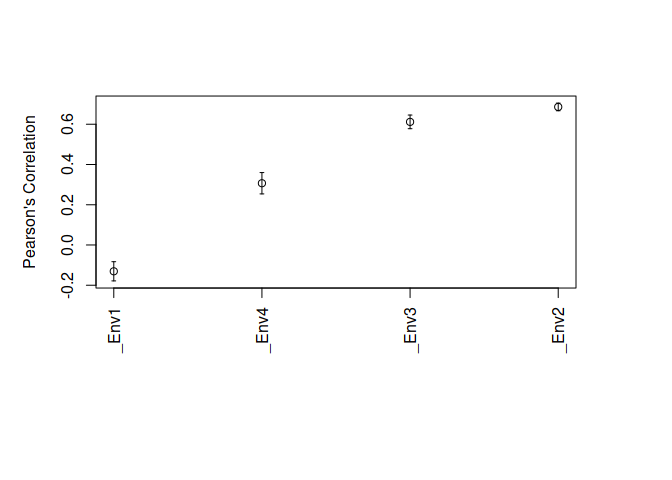
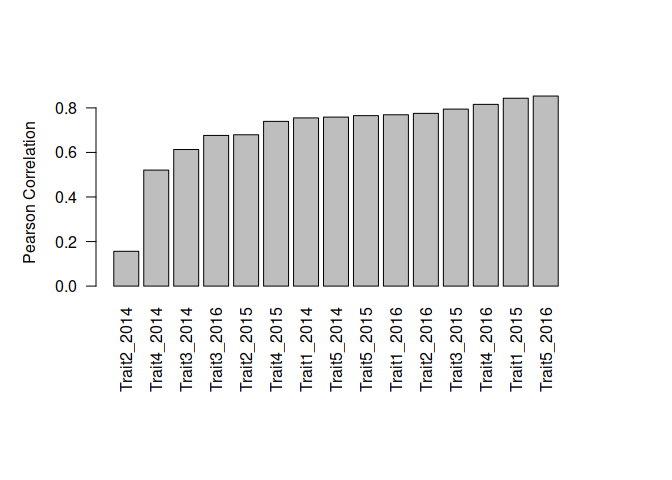
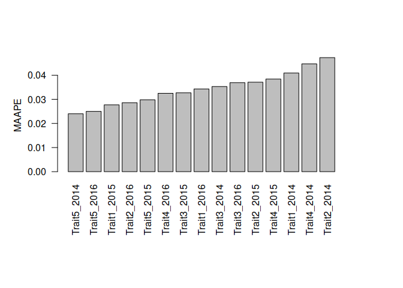

<p align="center">

<a href="https://github.com/frahik/IBCF.MTME">
 </a>

<h4 align="center">

**I**tem **B**ased **C**ollaborative **F**ilterign For
**M**ulti-**T**rait and **M**ulti-**E**nvironment Data in R -
Development version 1.6.0.

</h4>

<h4 align="center">

\[Last README update: 2019-03-22\]

</h4>

<p align="center">

<a href="https://www.tidyverse.org/lifecycle/#maturing">

</a> <a href="https://travis-ci.org/frahik/IBCF.MTME">

</a> <a href="https://ci.appveyor.com/project/frahik/ibcf-mtme">

</a> <a href='https://coveralls.io/github/frahik/IBCF.MTME?branch=master'>

</a> <a href="https://www.gnu.org/licenses/lgpl-3.0">

</a> <a href="http://www.repostatus.org/#active">

</a> <a href="">

</a> <a href="https://cran.r-project.org/package=IBCF.MTME">

</a>

</p>

</p>

# Table Of Contents

  - [NEWS](#news)
  - [Instructions](#instructions)
      - [Installation](#install)
      - [Load the package](#package)
      - [Example of Cross-validation with IBCF.MTME and external
        data](#example1)
          - [Load external data](#external-data)
          - [Generate a data set in tidy data](#generate-tidydata)
          - [Generate a Cross-validation](#generate-crossvalidation)
          - [Fitting the predictive model](#fit-model)
          - [Show some results](#results)
      - [Example of Years prediction with IBCF.Years
        Function](#example2)
          - [Loading your data](#external-data2)
          - [Transforming the data from Tidy data to matrix
            form](#generate-matrixform)
          - [Adjust the model](#adjust-model)
          - [Show some results](#results)
      - [Load available data from the package](#load-data)
  - [How to cite this package](#cite)
  - [Contributions](#contributions)
  - [Authors](#authors)

<h2 id="news">

News of this version (1.6.0)

</h2>

  - Fixed important issue with the predictions output.
  - Fixed compatibility with dplyr 0.8.
  - Fixed barplot function.

See the last updates in [NEWS](NEWS.md).

<h2 id="instructions">

Instructions for proper implementation

</h2>

<p align="center">

<a href="https://github.com/frahik/IBCF.MTME">
 </a>

</p>

<h3 id="install">

Installation

</h3>

To complete installation of dev version of the package `IBCF.MTME` from
GitHub, you must have previously installed the devtools package.

``` r
install.packages('devtools')
devtools::install_github('frahik/IBCF.MTME')
```

If you want to use the stable version of `IBCF.MTME` package, install it
from CRAN.

``` r
install.packages('IBCF.MTME')
```

<h3 id="package">

Load the package

</h3>

``` r
library(IBCF.MTME)
```

<h3 id="example1">

Example of Cross-validation with IBCF.MTME

</h3>

<h4 id="external-data">

Load available data from other package

</h4>

``` r
library(BGLR)
data(wheat)
```

<h4 id="generate-tidydata">

Generate a new data set in tidy data form

</h4>

``` r
pheno <- data.frame(ID = gl(n = 599, k = 1, length = 599*4),
                    Response = as.vector(wheat.Y),
                    Env = paste0('Env', gl(n = 4, k = 599)))

head(pheno)
```

    ##   ID   Response  Env
    ## 1  1  1.6716295 Env1
    ## 2  2 -0.2527028 Env1
    ## 3  3  0.3418151 Env1
    ## 4  4  0.7854395 Env1
    ## 5  5  0.9983176 Env1
    ## 6  6  2.3360969 Env1

<h4 id="generate-crossvalidation">

Generate 10 partitions to do
cross-validation

</h4>

``` r
CrossV <- CV.RandomPart(pheno, NPartitions = 10, PTesting = 0.25, Set_seed = 123)
```

<h4 id="fit-model">

Fitting the predictive model

</h4>

``` r
pm <- IBCF(CrossV)
```

<h4 id="results">

Show some results

</h4>

All the predictive model printed output:

``` r
pm
```

    ## Item Based Collaborative Filtering Model: 
    ##  Fitted with  10  random partitions
    ##  Runtime:  12.408  seconds 
    ## 
    ##  Some predicted values: 
    ##  [1]  -0.9554  -0.2731  -0.5007  -0.0909  -0.0501  -0.2599  -0.3494
    ##  [8]   0.0913  -0.0215  -0.4023  -0.8106   0.5702   0.4918  -1.5810
    ## [15]  -0.1540  -0.8060  -0.6665  -0.0671  -0.1934  -0.3210
    ## 
    ## Predictive capacity of the model: 
    ##    Environment  Trait  Pearson  SE_Pearson  MAAPE  SE_MAAPE
    ## 1         Env1          -0.131       0.024  0.931     0.011
    ## 2         Env2           0.686       0.010  0.674     0.012
    ## 3         Env3           0.612       0.017  0.682     0.007
    ## 4         Env4           0.307       0.027  0.762     0.011
    ## 
    ##  Use str() function to found more datailed information.

Predictions and observed data in tidy format

``` r
head(pm$predictions_Summary, 6)
```

    ##   Position Partition Environment Trait Observed Predicted
    ## 1        1         1        Env1         1.6716   -0.9554
    ## 2       14         1        Env1         0.3160   -0.2731
    ## 3       25         1        Env1        -1.1272   -0.5007
    ## 4       26         1        Env1        -0.4852   -0.0909
    ## 5       28         1        Env1         2.5940   -0.0501
    ## 6       30         1        Env1        -0.5190   -0.2599

Predictions and observed data in matrix
    format

``` r
head(pm$Data.Obs_Pred, 5)
```

    ##   ID      _Env1       _Env2      _Env3      _Env4 X_Env1.predicted
    ## 1  1  1.6716295 -1.72746986 -1.8902848  0.0509159       -0.9894943
    ## 2  2 -0.2527028  0.40952243  0.3093855 -1.7387588       -0.5478389
    ## 3  3  0.3418151 -0.64862633 -0.7995592 -1.0535691       -0.8596543
    ## 4  4  0.7854395  0.09394919  0.5704677  0.5517574        0.4040118
    ## 5  5  0.9983176 -0.28248062  1.6186819 -0.1142848        0.3243855
    ##   X_Env2.predicted X_Env3.predicted X_Env4.predicted
    ## 1       -0.8744692     -0.635018256       -0.5894103
    ## 2       -0.4165869     -0.370835578        0.1360170
    ## 3       -0.6766007              NaN       -0.3162934
    ## 4        0.5769577      0.347986885        0.5066996
    ## 5        1.0403187      0.001053535        0.7813698

Some plots

``` r
par(mai = c(2, 1, 1, 1))
plot(pm, select = 'Pearson')
```

<!-- -->

``` r
plot(pm, select = 'MAAPE')
```

<!-- -->

<h3 id="example2">

Example of Years prediction with IBCF.Years Function

</h3>

<h4 id="external-data2">

Loading your data

</h4>

``` r
load('DataExample.RData')
head(Data.Example)
```

    ##   Years Gids  Trait Response
    ## 1  2014    1 Trait1 15.14401
    ## 2  2014    2 Trait1 15.67879
    ## 3  2014    3 Trait1 14.85489
    ## 4  2014    4 Trait1 13.57002
    ## 5  2014    5 Trait1 15.01838
    ## 6  2014    6 Trait1 13.19616

<h4 id="generate-matrixform">

Transforming the data from Tidy data to matrix form

</h4>

``` r
Data.Example <- getMatrixForm(Data.Example, onlyTrait = TRUE)
head(Data.Example)
```

    ##   Years Gids   Trait1  Trait10  Trait11  Trait12   Trait2   Trait3
    ## 1  2014    1 15.14401 18.51428 17.08970 19.16776 16.21435 17.53858
    ## 2  2014    2 15.67879 18.21569 17.89645 19.94429 15.80614 17.89946
    ## 3  2014    3 14.85489 17.72576 15.78198 17.53058 14.06164 16.11997
    ## 4  2014    4 13.57002 18.57009 15.73343 17.49995 14.58312 15.22495
    ## 5  2014    5 15.01838 18.57348 16.97414 19.03081 14.98192 15.65125
    ## 6  2014    6 13.19616 16.83588 15.12312 17.39867 15.81264 14.80517
    ##     Trait4   Trait5   Trait6   Trait7   Trait8   Trait9
    ## 1 15.51840 17.59132 17.14852 17.04474 17.48970 18.36118
    ## 2 15.13337 18.36446 17.32734 17.46764 18.08501 18.67266
    ## 3 15.04329 17.28942 16.50978 16.26685 17.02774 17.05612
    ## 4 14.93028 16.33687 15.11493 15.06632 17.56798 16.48810
    ## 5 16.70963 16.81113 17.24170 15.53379 16.07600 16.54047
    ## 6 14.82150 16.49238 15.37325 14.07796 15.98419 15.84705

<h4 id="adjust-model">

Adjust the
model

</h4>

``` r
pm <- IBCF.Years(Data.Example, colYears = 1, Years.testing = c('2014', '2015', '2016'),
                 Traits.testing = c('Trait1', 'Trait2', 'Trait3', 'Trait4', "Trait5"))
```

<h4 id="results2">

Show some results

</h4>

``` r
summary(pm)
```

    ##    Environment  Trait Pearson  MAAPE
    ## 1         2014 Trait1  0.7549 0.0409
    ## 2         2014 Trait2  0.1562 0.0473
    ## 3         2014 Trait3  0.6130 0.0353
    ## 4         2014 Trait4  0.5208 0.0447
    ## 5         2014 Trait5  0.7587 0.0240
    ## 6         2015 Trait1  0.8432 0.0277
    ## 7         2015 Trait2  0.6792 0.0371
    ## 8         2015 Trait3  0.7944 0.0327
    ## 9         2015 Trait4  0.7394 0.0384
    ## 10        2015 Trait5  0.7651 0.0298
    ## 11        2016 Trait1  0.7690 0.0343
    ## 12        2016 Trait2  0.7753 0.0286
    ## 13        2016 Trait3  0.6763 0.0369
    ## 14        2016 Trait4  0.8157 0.0325
    ## 15        2016 Trait5  0.8533 0.0250

``` r
par(mai = c(2, 1, 1, 1))
barplot(pm, las = 2)
```

<!-- -->

``` r
barplot(pm, select = 'MAAPE', las = 2)
```

<!-- -->

<h4 id="load-data">

Load available data from the package

</h4>

You can use the data sets in the package to test the functions

``` r
library(IBCF.MTME)
data('Wheat_IBCF')

head(Wheat_IBCF)
```

    ##       GID Trait    Env   Response
    ## 1 6569128    DH Bed2IR -17.565895
    ## 2 6688880    DH Bed2IR  -4.565895
    ## 3 6688916    DH Bed2IR  -3.565895
    ## 4 6688933    DH Bed2IR  -4.565895
    ## 5 6688934    DH Bed2IR  -7.565895
    ## 6 6688949    DH Bed2IR  -7.565895

``` r
data('Year_IBCF')

head(Year_IBCF)
```

    ##   Years Gids Trait Response
    ## 1  2014    1    T1 5.144009
    ## 2  2014    2    T1 5.678792
    ## 3  2014    3    T1 4.854895
    ## 4  2014    4    T1 3.570019
    ## 5  2014    5    T1 5.018380
    ## 6  2014    6    T1 3.196160

<h2 id="cite">

Citation

</h2>

First option, by the article paper

    @article{IBCF2018,
    author = {Montesinos-L{\'{o}}pez, Osval A. and Luna-V{\'{a}}zquez, Francisco Javier and Montesinos-L{\'{o}}pez, Abelardo and Juliana, Philomin and Singh, Ravi and Crossa, Jos{\'{e}}},
    doi = {10.3835/plantgenome2018.02.0013},
    issn = {1940-3372},
    journal = {The Plant Genome},
    number = {3},
    pages = {16},
    title = {{An R Package for Multitrait and Multienvironment Data with the Item-Based Collaborative Filtering Algorithm}},
    url = {https://dl.sciencesocieties.org/publications/tpg/abstracts/0/0/180013},
    volume = {11},
    year = {2018}
    }

Second option, by the manual package

``` r
citation('IBCF.MTME')
```

    ## 
    ## To cite package 'IBCF.MTME' in publications use:
    ## 
    ##   Francisco Javier Luna-Vazquez, Osval Antonio Montesinos-Lopez,
    ##   Abelardo Montesinos-Lopez and Jose Crossa (2019). IBCF.MTME:
    ##   Item Based Collaborative Filtering for Multi-Trait and
    ##   Multi-Environment Data. R package version 1.6-0.
    ##   https://github.com/frahik/IBCF.MTME
    ## 
    ## A BibTeX entry for LaTeX users is
    ## 
    ##   @Manual{,
    ##     title = {IBCF.MTME: Item Based Collaborative Filtering for Multi-Trait and Multi-Environment Data},
    ##     author = {Francisco Javier Luna-Vazquez and Osval Antonio Montesinos-Lopez and Abelardo Montesinos-Lopez and Jose Crossa},
    ##     year = {2019},
    ##     note = {R package version 1.6-0},
    ##     url = {https://github.com/frahik/IBCF.MTME},
    ##   }

<h2 id="contributions">

Contributions

</h2>

If you have any suggestions or feedback, I would love to hear about it.
Feel free to report new issues in [this
link](https://github.com/frahik/IBCF.MTME/issues/new), also if you want
to request a feature/report a bug, or make a pull request if you can
contribute.

<h2 id="authors">

Authors

</h2>

  - Francisco Javier Luna-Vázquez (Author, Maintainer)
  - Osval Antonio Montesinos-López (Author)
  - Abelardo Montesinos-López (Author)
  - José Crossa (Author)
